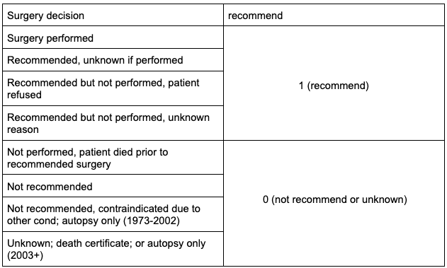
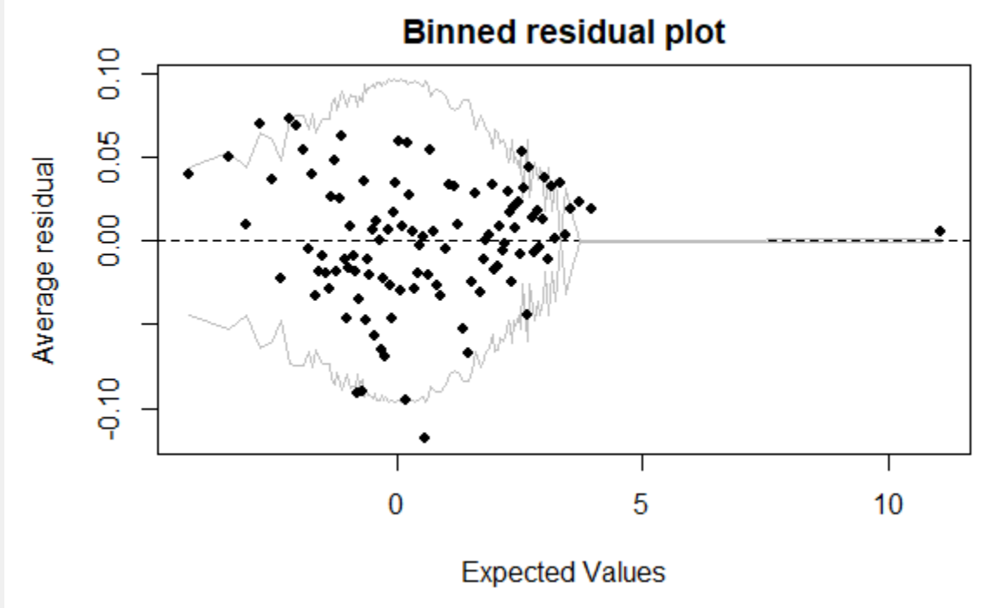
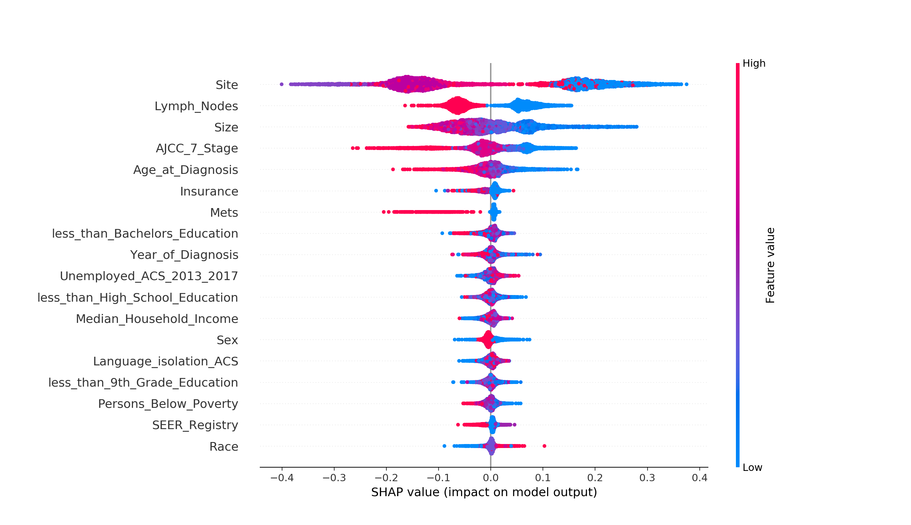
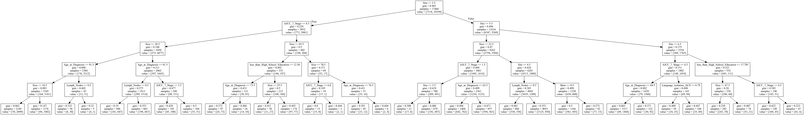
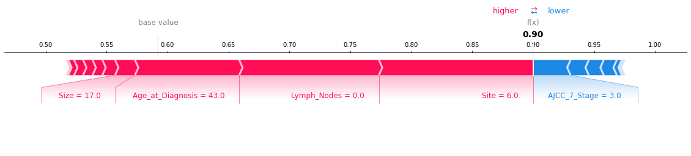

```{r setup, include=FALSE}
knitr::opts_chunk$set(echo = TRUE)
library(tidyverse)
library(readxl)
library(funModeling)
library(tree)
library(randomForest)
library(rstatix)
library(ggpubr)
library(corrgram)
library(ggplot2)
library(gridExtra)
library(psych)
library(gtools)
library(ROCR)
library(arm)
library(lmerTest)
```

# Abstract

The Surveillance, Epidemiology, and End Results (SEER) Program provides information on cancer statistics in an effort to reduce the cancer burden among the U.S. population. SEER is supported by the Surveillance Research Program (SRP) in NCI's Division of Cancer Control and Population Sciences (DCCPS).The SEER research data include SEER incidence and population data associated by age, sex, race, year of diagnosis, and geographic areas (including SEER registry and county). For this project, we focus on analyzing the head and neck cancers data set. 

# Background

After we looked through the related materials and had some explorations about the data, we decided to focus on finding out what kinds of factors that affect the doctor's diagnosis when they give the patient surgery suggestions. In other words, what we are interested in doing in this project is figuring out what kind of patients are recommended to do the surgery.

In this project, after data processing and EDA, we built the Logistic regression model, multilevel logistic regression model and random forest model to explore the relationship among variables from the transformed SEER data. What's more, the classifier model can also be used to forecast whether a doctor will recommend a patient for surgery.

```{r warning = FALSE, message = FALSE, echo = FALSE}
Health_Literacy_Transformed_Data   <-read.csv("data.csv")
logisdata <- Health_Literacy_Transformed_Data
```

# Data Processing

After reading the transformed SEER data set in R, we can see that there are 25 variables and 23291 observations in our data set. There’s no missing values in the data.

```{r warning = FALSE, message = FALSE, echo = FALSE}
# check na
sum(is.na(logisdata))
# Change colname
Clean_data <- dplyr::rename(logisdata,Study_ID=1,Year_of_Diagnosis=3,Age_at_Diagnosis=4,SEER_Registry=7,less_than_9th_Grade_Education=8,
              less_than_High_School_Education=9,less_than_Bachelors_Education=10,Persons_Below_Poverty=11,
              Unemployed_ACS_2013_2017=12,Median_Household_Income=13,Language_isolation_ACS=14,
              AJCC_7_Stage=17,Lymph_Nodes=19,Cause_of_Death=21,Surgery_Performed=22,Surgery_Decision=23)
# change to numeric
Clean_data1 <- Clean_data
Clean_data1$Surgery_Decision <- ifelse(Clean_data$Surgery_Decision=="Surgery performed",1,
                                     ifelse(Clean_data$Surgery_Decision=="Not recommended",0,
                                            ifelse(Clean_data$Surgery_Decision=="Recommended but not performed, patient refused",2,
                                                    3)))
# logistic data
logisdata <- Clean_data
unique(logisdata$Surgery_Decision)
logisdata$recommend <- ifelse(logisdata$Surgery_Decision %in% c('Surgery performed','Recommended, unknown if performed',
                                                                'Recommended but not performed, patient refused',
                                                                'Recommended but not performed, unknown reason'
                                                                ),1,0)

# random forest data
rfdata <- logisdata
rfdata$Sex <- ifelse(rfdata$Sex=='Male',1,0)
rfdata$Race <- ifelse(rfdata$Race=='American Indian/Alaska Native',1,
                      ifelse(rfdata$Race=='Black',2,
                             ifelse(rfdata$Race=='White',3,
                                    ifelse(rfdata$Race=='Asian or Pacific Islander',4,5))))
rfdata$Insurance <- ifelse(rfdata$Insurance=='Uninsured',0,
                           ifelse(rfdata$Insurance=='Insured',1,
                                  ifelse(rfdata$Insurance=='Any Medicaid',2,3)))
rfdata$SEER_Registry <- ifelse(rfdata$SEER_Registry=='California',1,
                               ifelse(rfdata$SEER_Registry=='Connecticut',2,
                                      ifelse(rfdata$SEER_Registry=='Georgia',3,4)))
rfdata$AJCC_7_Stage <- ifelse(rfdata$AJCC_7_Stage=='I',1,
                              ifelse(rfdata$AJCC_7_Stage=='II',2,
                              ifelse(rfdata$AJCC_7_Stage=='III',3,
                              ifelse(rfdata$AJCC_7_Stage=='IVA',4,
                              ifelse(rfdata$AJCC_7_Stage=='IVB',5,
                              ifelse(rfdata$AJCC_7_Stage=='IVC',6,7))))))
rfdata$Surgery_Performed <- ifelse(rfdata$Surgery_Performed=='Yes',1,0)
rfdata$Lymph_Nodes <- ifelse(rfdata$Lymph_Nodes=='No Nodal Involvement',0,1)
rfdata$Mets <- ifelse(rfdata$Mets=='No Mets',0,1)
rfdata$Site <- ifelse(rfdata$Site=='Oral Cavity',1,
                  ifelse(rfdata$Site=='Sinonasal',2,
                  ifelse(rfdata$Site=='Nasopharynx',3,
                  ifelse(rfdata$Site=='Oropharynx',4,
                  ifelse(rfdata$Site=='Larynx',5,
                  ifelse(rfdata$Site=='Salivary Gland',6,7))))))

# scale
rfdata_scale <- rfdata
rfdata_scale$Sex <- rfdata_scale$Sex/1.0661
rfdata_scale$Year_of_Diagnosis <- rfdata_scale$Year_of_Diagnosis/1.0064
rfdata_scale$Age_at_Diagnosis <- rfdata_scale$Age_at_Diagnosis/1.0302
rfdata_scale$Race <- rfdata_scale$Race/1.1683
rfdata_scale$Insurance <- rfdata_scale$Insurance/1.0427
rfdata_scale$SEER_Registry <- rfdata_scale$SEER_Registry/1.9598
rfdata_scale$less_than_9th_Grade_Education <- rfdata_scale$less_than_9th_Grade_Education/2.9835
rfdata_scale$less_than_High_School_Education <- rfdata_scale$less_than_High_School_Education/3.4123
rfdata_scale$less_than_Bachelors_Education <- rfdata_scale$less_than_Bachelors_Education/3.2646
rfdata_scale$Persons_Below_Poverty <- rfdata_scale$Persons_Below_Poverty/3.325
rfdata_scale$Unemployed_ACS_2013_2017 <- rfdata_scale$Unemployed_ACS_2013_2017/2.6114
rfdata_scale$Median_Household_Income <- rfdata_scale$Median_Household_Income/3.4496
rfdata_scale$Language_isolation_ACS <- rfdata_scale$Language_isolation_ACS/2.3825
rfdata_scale$Site <- rfdata_scale$Site/1.1648
rfdata_scale$AJCC_7_Stage <- rfdata_scale$AJCC_7_Stage/1.376
rfdata_scale$Size <- rfdata_scale$Size/1.2939
rfdata_scale$Lymph_Nodes <- rfdata_scale$Lymph_Nodes/1.7001
rfdata_scale$Mets <- rfdata_scale$Mets/1.1915

# as.factor logistic
logisdata.factor <- logisdata
logisdata.factor$Sex<-as.factor(logisdata.factor$Sex)
logisdata.factor$Race<-as.factor(logisdata.factor$Race)
logisdata.factor$Insurance<-as.factor(logisdata.factor$Insurance)
logisdata.factor$SEER_Registry<-as.factor(logisdata.factor$SEER_Registry)
logisdata.factor$Site<-as.factor(logisdata.factor$Site)
logisdata.factor$AJCC_7_Stage<-as.factor(logisdata.factor$AJCC_7_Stage)
logisdata.factor$Lymph_Nodes<-as.factor(logisdata.factor$Lymph_Nodes)
logisdata.factor$Mets<-as.factor(logisdata.factor$Mets)


```

```{r pressure, echo=FALSE, fig.cap="A caption", out.width = '100%'}

```
Based on the transformed data from SEER, to start our analysis, we first create a response variable that indicates whether or not the patient is recommended to perform the surgery according to the doctors. So we create the variable- "recommend" by extracting the information from "surgery decision" column.

The goal of our analysis in this project is to figure out what kind of patients are recommended to do the surgery. So what we need is only the demographic information of the patients and the information about the cancer they have. We don’t need to know （don’t want to know） whether the patient has died and whether they have undergone chemotherapy or radiotherapy. Hence we have to exclude the "Cause of death", "Chemotherapy", "Radiation", "Surgery_Decision", "Surgery_Performed" from the data set. The "Study ID" also does not need to include in our dataset.

After excluding the variables we don’t need, we have the data set with below variables and ready to perform some EDA.


# EDA

In the EDA section, we firstly used the ggplot2 package to generate some bar plots and box plots to check whether each variable is related to the doctor's recommendation. Then we performed more advanced plots and visualize the correlation between some features to see if there are highly correlated variables.


```{r fig2, fig.height = 10, fig.width = 10, fig.align = "center",warning = FALSE, message = FALSE, echo = FALSE}
logisdata$recommend<-as.factor(logisdata$recommend)
p1<-ggplot(logisdata, aes(x = Insurance, fill =recommend )) + 
  geom_bar(position = "fill") +
  labs(y = "Proportion")+
  theme(axis.text.x = element_text(angle = 45, hjust = 0.5, vjust = .5))
p2<-ggplot(logisdata, aes(x = Sex, fill =recommend)) + 
  geom_bar(position = "fill") +
  labs(y = "Proportion")+
  theme(axis.text.x = element_text(angle = 45, hjust =0.5, vjust = .5))
p3<-ggplot(logisdata, aes(x = Race, fill =recommend )) + 
  geom_bar(position = "fill") +
  labs(y = "Proportion")+
  theme(axis.text.x = element_text(angle = 45, hjust = 0.5, vjust = .5))
p4<-ggplot(logisdata, aes(x = SEER_Registry, fill =recommend )) + 
  geom_bar(position = "fill") +
  labs(y = "Proportion")+
  theme(axis.text.x = element_text(angle = 45, hjust = 0.5, vjust = .5))
p5<-ggplot(logisdata, aes(x = Site, fill =recommend)) + 
  geom_bar(position = "fill") +
  labs(y = "Proportion")+
  theme(axis.text.x = element_text(angle = 45, hjust = 0.5, vjust = .5))
p7<-ggplot(logisdata, aes(x = AJCC_7_Stage, fill =recommend)) + 
  geom_bar(position = "fill") +
  labs(y = "Proportion")+
  theme(axis.text.x = element_text(angle = 45, hjust = 0.5, vjust = .5))
p8<-ggplot(logisdata, aes(x = Lymph_Nodes, fill =recommend)) + 
  geom_bar(position = "fill") +
  labs(y = "Proportion")+
  theme(axis.text.x = element_text(angle = 45, hjust = 0.5, vjust = .5))
p9<-ggplot(logisdata, aes(x = Mets, fill =recommend)) + 
  geom_bar(position = "fill") +
  labs(y = "Proportion")+
  theme(axis.text.x = element_text(angle = 45, hjust = 0.5, vjust = .5))
grid.arrange(p1,p2,p3,p4,p5,p7,p8,p9,ncol=2)
```

Firstly, we want to find the relationship between each categorical variable and recommendation. From this figure, we can see 'Sex','Site','AJCC.7.Stage','lymph.nodes' and 'mets' have the significant impact on the recommendation. But 'Race' 'Insurance','SEER.Registry' have the slight impact on whether doctor recommend the patient to do the surgery.

```{r fig3, fig.height = 12, fig.width = 10, fig.align = "center",warning = FALSE, message = FALSE, echo = FALSE}
logisdata$recommend=as.factor(logisdata$recommend)
p1<-ggplot(logisdata,aes(x=Age_at_Diagnosis,y=recommend))+
  geom_boxplot(aes(fill=recommend))+ 
  coord_flip()

p2<-ggplot(logisdata,aes(x=Year_of_Diagnosis,y=recommend))+
  geom_boxplot(aes(fill=recommend))+ 
  coord_flip()

p3<-ggplot(logisdata,aes(x=less_than_9th_Grade_Education,y=recommend))+
  geom_boxplot(aes(fill=recommend))+ 
  coord_flip()

p4<-ggplot(logisdata,aes(x=less_than_High_School_Education,y=recommend))+
  geom_boxplot(aes(fill=recommend))+ 
  coord_flip()

p5<-ggplot(logisdata,aes(x=less_than_Bachelors_Education,y=recommend))+
  geom_boxplot(aes(fill=recommend))+ 
  coord_flip()

p6<-ggplot(logisdata,aes(x=Persons_Below_Poverty,y=recommend))+
  geom_boxplot(aes(fill=recommend))+ 
  coord_flip()

p7<-ggplot(logisdata,aes(x=Unemployed_ACS_2013_2017,y=recommend))+
  geom_boxplot(aes(fill=recommend))+ 
  coord_flip()

p8<-ggplot(logisdata,aes(x=Median_Household_Income,y=recommend))+
  geom_boxplot(aes(fill=recommend))+ 
  coord_flip()

p9<-ggplot(logisdata,aes(x=Language_isolation_ACS,y=recommend))+
  geom_boxplot(aes(fill=recommend))+ 
  coord_flip()

p10<-ggplot(logisdata,aes(x=Size,y=recommend))+
  geom_boxplot(aes(fill=recommend))+ 
  coord_flip()
grid.arrange(p1,p2,p3,p4,p5,p6,p7,p8,p9,p10,ncol=2)
```

Similarly, we also tried to find the relationship between the continuous variable and recommendation. As the figure shows, 'size','language_isolation' has bigger influence on the recommendation.

```{r warning = FALSE, message = FALSE, echo = FALSE}
ggplot(logisdata,aes(x=Race,..count..))+
  geom_bar(aes(fill=recommend),position="fill")+
  theme(axis.text.x = element_text(angle = 90, hjust = 1, vjust = .5))+
  facet_grid(SEER_Registry~Insurance)
```
Then we combined three categorical variables randomly, we tried to find the interaction by this method when we did the model. As the figure shows, the proportion of the recommend of the person who are white in different 'REER_Registry' vary. So we consider this in our model when we need to add the interactions into the model.
```{r fig4, fig.height = 6, fig.width = 8, fig.align = "center", warning = FALSE, message = FALSE, echo = FALSE} 
#correlation
corrgram(logisdata,order=TRUE,lower.panel = panel.shade,upper.panel = panel.pie,text.panel = panel.txt)
```
When we have done the eda part, we found that some relationships among some variables. For example, the boxplots show that the distribution of the recommendation for the "less_than_High_School_Education" and "less_than_Bachelors_Education" are generally same. And then we think that we can combine the highly correlated colunms.


# Model

In the modeling part, we use logistic regression and random forest to explore the important features for doctors to decide whether or not to recommend the patients to perform a surgery.

## Logistic Regression

### hypothesis test

Logistic regression model is a very popular modeling method when the outcome is binary. Before we fit a logistic regression model, we firstly apply hypothesis testing between different features versus“recommend”.

For the continuous variables, we performed two sample t-tests to determine whether the relationship between these variables and “recommend” is statistically significant. For the categorical data. We performed the Chi-square test and Fisher exact test for the same purpose.

```{r warning = FALSE, message = FALSE, echo = FALSE}
#t test for continuous variable
#continuous data
conti_data=dplyr::select(logisdata,Year_of_Diagnosis,Age_at_Diagnosis,less_than_9th_Grade_Education
,less_than_High_School_Education,
less_than_Bachelors_Education,
Persons_Below_Poverty
,Unemployed_ACS_2013_2017
,Median_Household_Income
,Language_isolation_ACS
,Size
,recommend
)

# Transform the data into long format
# Put all variables in the same column except `recommend`, the grouping variable
conti_long <- conti_data %>%
  pivot_longer(-recommend, names_to = "variables", values_to = "value")
#two sample t test
stat.test <- conti_long %>%
  group_by(variables) %>%
  t_test(value ~ recommend) %>%
  adjust_pvalue(method = "BH") %>%
  add_significance()
stat.test
stat.test=stat.test[,c(1,9,10,11)]


#For categorical variable, perform  chi-square test and fisher exact test
t1=chisq.test(logisdata$Sex,logisdata$recommend)

t2=chisq.test(logisdata$Year_of_Diagnosis,logisdata$recommend)


t3=chisq.test(logisdata$Race,logisdata$recommend)


t4=chisq.test(logisdata$Insurance,logisdata$recommend)


t5=chisq.test(logisdata$SEER_Registry,logisdata$recommend)


t6=chisq.test(logisdata$Site,logisdata$recommend)


t7=fisher.test(logisdata$Subsite,logisdata$recommend,simulate.p.value=TRUE)


t8=chisq.test(logisdata$AJCC_7_Stage,logisdata$recommend)


t9=chisq.test(logisdata$Lymph_Nodes,logisdata$recommend)


t10=chisq.test(logisdata$Mets,logisdata$recommend)


t11=chisq.test(logisdata$Cause_of_Death,logisdata$recommend)


t12=fisher.test(logisdata$Radiation,logisdata$recommend,simulate.p.value=TRUE)


t13=chisq.test(logisdata$Chemotherapy,logisdata$recommend)
##Build a data frame
cate_p_value=c(t1$p.value ,t2$p.value ,t3$p.value ,t4$p.value ,t5$p.value ,t6$p.value ,t7$p.value ,t8$p.value 
               ,t9$p.value ,t10$p.value ,t11$p.value ,t12$p.value ,t13$p.value )
cate_variable=colnames(logisdata)[c(2,3,5,6,7,15,16,17,19,20,21,24,25)]
chi_data=data.frame(cate_variable,cate_p_value)
chi_data$adj_p_value=adjust_pvalue(chi_data$cate_p_value,method = "BH")
chi_data$sig=stars.pval(chi_data$adj_p_value)
names(chi_data)=names(stat.test)
hypodata=rbind(stat.test,chi_data)
hypodata
```
We create a dataframe which includes the hypothesis test result for each variable, as we can see from the above output, only three variables give us no significant result. They are “Unemployed_ACS_2013_2017”, “less_than_High_School_Education”, “less_than_Bachelors_Education” . For these three variables,  there doesn’t exist a clear relationship with recommend intention. So we won’t include these three features into the logistic regression for now.

### Baseline Model

We firstly centralized the continuous variables in the data set.
After randomly splitting the data into train and test sets, we fit a baseline logistic regression with all other variables left. From the summary output, we can see that there are several variables that give a low p-value indicating these variables are a meaningful addition to the model. It is to say, these features are more important to decide the outcome by logistic regression.

```{r warning = FALSE, message = FALSE, echo = FALSE}
#logistic regression
#data proccessing
logisdata$Race_1[logisdata$Race=="American Indian/Alaska Native"|logisdata$Race=="Asian or Pacific Islander"
                 |logisdata$Race=="Black"|logisdata$Race=="Hispanic"]="other Race"
logisdata$Race_1[logisdata$Race=="White"]="White"
#rescale continuous variables
logisdata$Year_of_Diagnosis=scale(logisdata$Year_of_Diagnosis)
logisdata$Median_Household_Income=scale(logisdata$Median_Household_Income)
logisdata$Age_at_Diagnosis=scale(logisdata$Age_at_Diagnosis)
logisdata$less_than_9th_Grade_Education=scale(logisdata$less_than_9th_Grade_Education)
logisdata$Persons_Below_Poverty=scale(logisdata$Persons_Below_Poverty)
logisdata$Language_isolation_ACS=scale(logisdata$Language_isolation_ACS)
logisdata$Size=scale(logisdata$Size)

#split train and test
set.seed(1) 
train <- sample(1:nrow(Clean_data1), nrow(Clean_data1) / 2) 
Clean_data1.train <- Clean_data1[train, ]
Clean_data1.test <- Clean_data1[-train, ]
logisdata.train <- logisdata[train,]
logisdata.test <- logisdata[-train,]
logisdata.test <- logisdata.test[-which(logisdata.test$Surgery_Decision=='Unknown; death certificate; or autopsy only (2003+)'),]
#basic model
log.logisdata <- glm(factor(recommend)~factor(Sex)
             +Year_of_Diagnosis
             +Age_at_Diagnosis
             +factor(Race_1)
             +factor(Insurance)
             +factor(SEER_Registry)
             +less_than_9th_Grade_Education
             +Persons_Below_Poverty
             +Median_Household_Income
             +Language_isolation_ACS
             +factor(Site)
             +factor(AJCC_7_Stage)
             +factor(Subsite)
             +Size
             +factor(Lymph_Nodes)
             +factor(Mets)
, data = logisdata.train, family = binomial(link="logit"))

```

The AIC value for this basic logistic regression model is 10593. After this, we predict the test data set using the baseline model and get the accuracy 0.7785, also calculate the AUC value is 0.773.

```{r warning = FALSE, message = FALSE, echo = FALSE}
#AIC 10593
summary(log.logisdata)$aic
#accuracy 0.7785
logisdata.test$predicted.reco = predict(log.logisdata, newdata=logisdata.test, type="response")
logisdata.test$predicted.reco=ifelse(logisdata.test$predicted.reco>0.5,1,0)
table(logisdata.test$recommend==logisdata.test$predicted.reco)

acc=mean(logisdata.test$predicted.reco==logisdata.test$recommend)
acc
#ROC Curve and
#AUC 0.773
pred <- prediction(logisdata.test$predicted.reco, logisdata.test$recommend)
perf <- performance(pred, measure = "tpr", x.measure = "fpr")

plot(perf)
auc <- performance(pred, measure = "auc")
auc <- auc@y.values[[1]]
auc
```


### Improved Logistic Regression Model

Now let’s remove all insignificant independent variables from the prediction model, In this model we will remove “Sex” and “Mets” and “Race” , also the intercept.	The AIC decreased to 10589 and the predicted accuracy and the AUC value remain steady.
```{r warning = FALSE, message = FALSE, echo = FALSE}
#move out sex and mets and intercept and Race
log.logisdata_2 <- glm(recommend~ Year_of_Diagnosis
             +Age_at_Diagnosis
             +Insurance
             +SEER_Registry
             +less_than_9th_Grade_Education
             +Persons_Below_Poverty
             +Median_Household_Income
             +Language_isolation_ACS
             +Site
             +AJCC_7_Stage
             +Subsite
             +Size
             +Lymph_Nodes-1
, data = logisdata.train, family = binomial(link="logit"))

```

```{r warning = FALSE, message = FALSE, echo = FALSE}
#AIC 10589
summary(log.logisdata_2)$aic
logisdata.test$predicted.reco = predict(log.logisdata_2, newdata=logisdata.test, type="response")
logisdata.test$predicted.reco=ifelse(logisdata.test$predicted.reco>0.5,1,0)
table(logisdata.test$recommend==logisdata.test$predicted.reco)

#ACC 0.7782
acc2=mean(logisdata.test$predicted.reco==logisdata.test$recommend)
acc2

#AUC 0.772
pred <- prediction(logisdata.test$predicted.reco, logisdata.test$recommend)
perf <- performance(pred, measure = "tpr", x.measure = "fpr")
plot(perf)
auc2 <- performance(pred, measure = "auc")
auc2 <- auc2@y.values[[1]]

auc2
```

### Final model: add interaction

From the EDA part,we notice some of the variables in the transformed data may be highly correlated. So based on our knowledge, The AJCC stage of a cancer patient is decided by it’s tumor size (T stage) and the Lymph Nodes(N stage), the Site of the cancer he has, also the distant metastasis (M stage). So for these variables, we may need to add interaction terms in the model. Also, the poverty of the patient may have an interaction effect with his educational level, unemployment status, income and so on. We may need to also consider these into our model.

In our final model, we add these interaction terms and from the result, we can see that the model can produce an accuracy of around 80% and the AIC score improved to 10308, the AUC value increased to 0.785, which is an acceptable level for a regression model.

```{r warning = FALSE, message = FALSE, echo = FALSE}
#add interaction
log.logisdata_3 <- glm(recommend~
              Year_of_Diagnosis
             +Age_at_Diagnosis
             +Insurance
             +SEER_Registry +Language_isolation_ACS
             +Site
             +Size
             +Lymph_Nodes
             +AJCC_7_Stage
             +Subsite
             +less_than_9th_Grade_Education
             +less_than_Bachelors_Education:less_than_9th_Grade_Education
             +Site:AJCC_7_Stage:Lymph_Nodes:Size
             +Persons_Below_Poverty:Median_Household_Income:less_than_High_School_Education
             +AJCC_7_Stage:Site
             +Race_1:Language_isolation_ACS
             -1, data = logisdata.train, family = binomial(link="logit"))

#AIC10305
summary(log.logisdata_3)$coefficients 
logisdata.test$predicted.reco = predict(log.logisdata_3, newdata=logisdata.test, type="response")
logisdata.test$predicted.reco=ifelse(logisdata.test$predicted.reco>0.5,1,0)
table(logisdata.test$recommend==logisdata.test$predicted.reco)

#ACC 0.79
acc3=mean(logisdata.test$predicted.reco==logisdata.test$recommend)
acc3


#validation

# Compute AUC for predicting Class with the mode
pred <- prediction(logisdata.test$predicted.reco, logisdata.test$recommend)
perf <- performance(pred, measure = "tpr", x.measure = "fpr")
plot(perf)
auc3 <- performance(pred, measure = "auc")
auc3 <- auc3@y.values[[1]]
#acceptable 0.785
auc3
```
We also checked the binned residual plot for this model. The residual plot shows a fairly random pattern. This random pattern indicates that the model provides a decent fit to the data.

```{r warning = FALSE, message = FALSE, echo = FALSE}
#residual plot
binnedplot(predict(log.logisdata_3), resid(log.logisdata_3,type="response"))
```

## Multilevel Logistic Regression 

After getting a logistic regression model, we think that there is still space to improve the model. Since the response variable is binary, and we want to add the random effect to make the model better, so we choose the multilevel logistic regression. We considered that different regions may have different diagnosis standards among the doctors. So "SEER_Registry" might be thought of as random effect. And we also draw the figure to double check our suspectation.

```{r warning = FALSE, message = FALSE, echo = FALSE}
ggplot(logisdata,aes(Size,recommend,color=SEER_Registry))+
  geom_point()+
  geom_smooth(formula=y~x,method="lm",aes(group=SEER_Registry),se=F)
```

```{r pressures, echo=FALSE, fig.cap="A caption", out.width = '100%'}

```
This model spends too much time to get the result, we move this to appendix. While the result of this model is much better than the logistic baseline model, so if we have more time, we can improve this later!

## Random Forest

First we processed our data and chose some features that are actually associated with our response. The dataset was divided into 2 datasets: 50% training dataset and 50% testing dataset. 

Then we built a 19-factors model using a training dataset as our baseline model. After this, we used the importance() function to get important features. The least important variable will be removed. Repeat this process. So the next model will be one factor less than the last model. Finally, we calculated accuracy and chose a 15-factor model which removes "Mets", "SEER_Registry", "Sex" and "Race" features. The accuracy of this 15-factor model is around 78.72%. 

```{r warning = FALSE, message = FALSE, echo = FALSE}

# Split the data set into a training set and a test set.
set.seed(1) 
train <- sample(1:nrow(Clean_data1), nrow(Clean_data1) / 2) 
Clean_data1.train <- Clean_data1[train, ]
Clean_data1.test <- Clean_data1[-train, ]
logisdata.train <- logisdata[train,]
logisdata.test <- logisdata[-train,]
logisdata.test <- logisdata.test[-which(logisdata.test$Surgery_Decision=='Unknown; death certificate; or autopsy only (2003+)'),]

rfdata.train <- rfdata[train,]
rfdata.test <- rfdata[-train,]
rfdata.test <- rfdata.test[-which(rfdata.test$Surgery_Decision=='Unknown; death certificate; or autopsy only (2003+)'),]

rfdata_scale.train <- rfdata_scale[train,]
rfdata_scale.test <- rfdata_scale[-train,]
rfdata_scale.test <- rfdata_scale.test[-which(rfdata_scale.test$Surgery_Decision=='Unknown; death certificate; or autopsy only (2003+)'),]

logisdata.factor.train <- logisdata.factor[train,]
logisdata.factor.test <- logisdata.factor[-train,]
logisdata.factor.test <- logisdata.factor.test[-which(logisdata.factor.test$Surgery_Decision=='Unknown; death certificate; or autopsy only (2003+)'),]

```

```{r warning = FALSE, message = FALSE, echo = FALSE}
rf19.factor <- randomForest(recommend~.-Study_ID-Surgery_Decision-Cause_of_Death-Radiation-Chemotherapy-Surgery_Performed,
                           data = logisdata.factor, subset=train ,mtry=4,importance =TRUE) 
importance(rf19.factor)
# accuracy in test dataset
rf19_predict <- predict(rf19.factor, logisdata.factor.test)
real <- logisdata.factor.test$recommend
table(rf19_predict,real)
mean(rf19_predict==real)
# 0.7869472
```

```{r fig5, fig.height = 12, fig.width = 10, fig.align = "center", warning = FALSE, message = FALSE, echo = FALSE}
# importance
importance_rf19 <- data.frame(importance(rf19.factor), check.names = FALSE)

# show top19 important features
varImpPlot(rf19.factor, n.var = min(19, nrow(rf19.factor$importance)),
    main = 'Top 19 - variable importance')
```

There are two ways to evaluate the importance of features: Mean decrease accuracy and Mean decrease gini:
Mean decrease accuracy describes the degree to which the prediction accuracy of random forest is reduced when a variable is changed into a random number. The greater the value, the greater the importance of the variable.
Mean decrease gini calculated the heterogeneity influence of each variable on the observed values of each node in the classification tree through the Gini index. The higher the value, the greater the importance of the variable. 

From the Mean decrease accuracy plot, we can see the top 5 most important variables are "Site", "Size", "AJCC_7_Stage", "Subsite" and "Median_Household_Income". The two least important characteristics are "Year_of_Diagnosis" and "Sex". This also makes sense.  
From the Mean decrease gini plot, we can see the top 5 most important variables are "Site", "Subsite", "Size", "Age_at_Diagnosis" and "AJCC_7_Stage". The two least important characteristics are "Mets" and "SEER_Registry".  

By comparing the results of these two plots we find they are generally similar, but there are some small differences. For example, in the left plot, "Year_of_Diagnosis" is the least important variable but in the right picture, this is the 7th important feature.


```{r warning = FALSE, message = FALSE, echo = FALSE}
rf19.factor <- randomForest(recommend~.-Study_ID-Surgery_Decision-Cause_of_Death-Radiation-Chemotherapy-Surgery_Performed,
                           data = logisdata.factor, subset=train ,mtry=4,importance =TRUE) 

rf18.factor <- randomForest(recommend~.-Study_ID-Surgery_Decision-Cause_of_Death-Radiation-Chemotherapy
                            -Surgery_Performed-Mets,
                           data = logisdata.factor, subset=train ,mtry=4,importance =TRUE) 
rf17.factor <- randomForest(recommend~.-Study_ID-Surgery_Decision-Cause_of_Death-Radiation-Chemotherapy
                            -Surgery_Performed-Mets-SEER_Registry,
                           data = logisdata.factor, subset=train ,mtry=4,importance =TRUE) 
rf16.factor <- randomForest(recommend~.-Study_ID-Surgery_Decision-Cause_of_Death-Radiation-Chemotherapy
                            -Surgery_Performed-Mets-SEER_Registry-Sex,
                           data = logisdata.factor, subset=train ,mtry=4,importance =TRUE)
rf15.factor <- randomForest(recommend~.-Study_ID-Surgery_Decision-Cause_of_Death-Radiation-Chemotherapy-Surgery_Performed
                            -Mets-SEER_Registry-Sex-Race,
                           data = logisdata.factor, subset=train ,mtry=4,importance =TRUE)
rf14.factor <- randomForest(recommend~.-Study_ID-Surgery_Decision-Cause_of_Death-Radiation-Chemotherapy
                            -Surgery_Performed-Mets-SEER_Registry-Sex-Race-Insurance,
                           data = logisdata.factor, subset=train ,mtry=4,importance =TRUE)

```


```{r warning = FALSE, message = FALSE, echo = FALSE}
# accuracy in test dataset
rf19_predict <- predict(rf19.factor, logisdata.factor.test)
real <- logisdata.factor.test$recommend
table(rf19_predict,real)
mean(rf19_predict==real)

rf18_predict <- predict(rf18.factor, logisdata.factor.test)
real <- logisdata.factor.test$recommend
table(rf18_predict,real)
mean(rf18_predict==real)

rf17_predict <- predict(rf17.factor, logisdata.factor.test)
real <- logisdata.factor.test$recommend
table(rf17_predict,real)
mean(rf17_predict==real)

rf16_predict <- predict(rf16.factor, logisdata.factor.test)
real <- logisdata.factor.test$recommend
table(rf16_predict,real)
mean(rf16_predict==real)

rf15_predict <- predict(rf15.factor, logisdata.factor.test)
real <- logisdata.factor.test$recommend
table(rf15_predict,real)
mean(rf15_predict==real)

rf14_predict <- predict(rf14.factor, logisdata.factor.test)
real <- logisdata.factor.test$recommend
table(rf14_predict,real)
mean(rf14_predict==real)

```

```{r warning = FALSE, message = FALSE, echo = FALSE}
# 15-variables-model's confusion matrix
table(rf15_predict,real)
mean(rf15_predict==real)
```

In this confusion matrix, column is real situation and row is prediction. The calculation method of accuracy is to divide the sum of the diagonals by the sum of all values.  

SHAP, which stands for SHapley Additive exPlanations, is probably the state of the art in Machine Learning explainability. This algorithm was first published in 2017 by Lundberg and Lee (here is the original paper) and it is a brilliant way to reverse-engineer the output of any predictive algorithm. 

In a nutshell, SHAP values are used whenever we have a complex model (could be a gradient boosting, a neural network, or anything that takes some features as input and produces some predictions as output) and we want to understand what decisions the model is making. For calculation, we use Python to calculate the marginal contribution of a feature when it is added to the model, and then take the mean value, namely the SHAP baseline value of a certain feature, into account the different marginal contributions of this feature in all feature sequences.

```{r pressuress, echo=FALSE, fig.cap="A caption", out.width = '100%'}

```

As shown above, our group used the Shap package in the Python environment to consider and include the effect of the interaction between each feature. The color of the feature tends to be red if the value of the feature is higher while it  tends to be blue if the value of feature is lower. For example, when the value of Lymph_Nodes is  “No Nodal Involvement”, it will have a negative effect on recommending surgery while the value is “Nodal Involvement” it will have the same but positive effect as “No Nodal Involvement”. However,both effects are not always the same among those factors, such as Mets and Size, the effect of high value in one side has much more influence on recommending surgery decisions than the other side. In other words, it means that the doctor does not tend to recommend patients to do surgery with distant Mets while cancer with no Mets will not impact much on recommending surgery decisions.

# Conclusion

To conclude our analysis, both the logistic regression model and the random forest model can give us similar important factors which contribute to the “recommend” variable. To be specific, "the AJCC stage of cancer", also "Site" of their cancer, the "Size" of the tumor, and the "lymph nodes", these features related to the cancer situation are the most important factors the doctors need to consider to decide whether or not a patient needs surgery. Besides, the demographic information of the patients also matters, especially the age of diagnosis and the insurance status are very important features according to the models. What’s more, the features like educational level, the unemployment status and household income, poverty situation…..together, these variables also include some information for the doctors to take into consideration when trying to give surgery suggestions.

# Discussion & Limitation

For the modeling part, logistic regression can give us quick and accurate predictions. We can filter the features during the modeling selection process, it's also easy to interpret. However, there is a lot of characteristic variables and interaction terms. The coefficient output seems to be too lengthy. It is difficult to find out the specific effect of each variable on the outcome.
For the multilevel model, we just simply add some random effects based on the baseline logistic regression model, indeed it can give a better performance, however, fitting this model needs to spend a very long time, it’s hard to do the model selection so we drop this idea for now.

Random Forests can be used for both classification and regression tasks. It also works well with both categorical and numerical data without re-scaling or transformation of variables. However, Random Forests are not easily interpretable. They provide feature importance but it does not provide complete visibility into the coefficients as linear regression. In this project, the categorical features in the Shap value of the tree model can only be converted into numerical ones, which we need to improve.

There are also some other limitations to the data we used. Firstly, all the patients in the model were diagnosed from 2010 to 2015, it’s a little outdated, the doctor’s diagnostic criteria after 2015 may be changed. Secondly, For some variables, there are some biases since some of the categories in specific variables (like race and SEER registry) have too few observations. These biases may influence our modeling results.

Our next step for this project will be to look into more details in adding random effects on the logistic regression model and also try other algorithms. In addition, we need to find a better explanation of the Shap value in the random forest model.

# Appendix

The proportion of different 
```{r}
freq(logisdata$recommend)
```

```{r}
names(logisdata)[names(logisdata) == "% Language isolation ACS 2013-2017 (households)"] <- "Language_isolation"
  logisdata$Language_isolation <- ifelse(logisdata$Language_isolation< 4,"Best",
                                       ifelse(logisdata$Language_isolation>=4&logisdata$Language_isolation<8,"Good",
                                              ifelse(logisdata$Language_isolation>=8,"Bad",3)))
  

logisdata$Persons_Below_Poverty <- ifelse(logisdata$Persons_Below_Poverty< 10,"rich",ifelse(logisdata$Persons_Below_Poverty>=10&logisdata$Persons_Below_Poverty<20,"average",
                                              ifelse(logisdata$Persons_Below_Poverty>=20&logisdata$Persons_Below_Poverty<30,"poor",ifelse(logisdata$Persons_Below_Poverty>=30&logisdata$Persons_Below_Poverty<50,"very poor",4))))
  
  sum(ifelse(logisdata$Persons_Below_Poverty=="very poor" & logisdata$Race=="Asian or Pacific Islander",1,0))
  logisdata$Persons_Below_Poverty=as.factor(logisdata$Persons_Below_Poverty)
    ggplot(logisdata,aes(x=Insurance,..count..))+
    geom_bar(aes(fill=recommend),position="fill")+ 
    theme(axis.text.x = element_text(angle = 90, hjust = 1, vjust = .5))+
    facet_grid(Mets~ logisdata$Lymph_Nodes)
```
Multilevel Logistics Regression Model
```{r}
fit_multi<-glmer(factor(recommend)~Age_at_Diagnosis+factor(Mets)+factor(Insurance)+factor(Sex)+
                factor(Race)+factor(Site)+factor(Subsite)+less_than_High_School_Education+less_than_9th_Grade_Education+less_than_Bachelors_Education+Unemployed_ACS_2013_2017+(1 + Size|SEER_Registry), data = logisdata.train,             family=binomial(),control=glmerControl(optimizer = "Nelder_Mead",optCtrl=list(maxfun=100000)))

summary(fit_multi)
#AIC 10848
#BIC 11488
#ACC 0.783
logisdata.test$predicted.reco = predict(fit_multi, newdata=logisdata.test, type="response")
logisdata.test$predicted.reco=ifelse(logisdata.test$predicted.reco>0.5,1,0)

pred <- prediction(logisdata.test$predicted.reco, logisdata.test$recommend)
perf <- performance(pred, measure = "tpr", x.measure = "fpr")
plot(perf)
auc <- performance(pred, measure = "auc")
auc <- auc@y.values[[1]]
#acceptable 0.785
auc
binnedplot(predict(fit_multi), resid(fit_multi,type="response"))
```

```{r pressuresss, echo=FALSE, fig.cap="A caption", out.width = '100%'}

```

```{r pressuresssss, echo=FALSE, fig.cap="A caption", out.width = '100%'}

```


